# Project "Flask Shop"
### command structure / склад команди:
- Illya Shramko / Ілля Шрамко [github.com/IllyaShramko](https://github.com/IllyaShramko)
- Timur Koshel / Тимур Кошель [github.com/kosheltimur](https://github.com/kosheltimur)
- Egor Galkin / Егор Галкін [github.com/EgorGalkinORG](https://github.com/EgorGalkinORG)
- David Petrenko / Давид Петренко [github.com/Davidptn](https://github.com/Davidptn)
____
# Main Information of project / Основна Інформація про проект:
### Flask Shop project can / Flask Shop project може робити:
- Start up / Запускатися
- Process Authorizations, Registrations and record them in the database / Опрацьовувати Авторизації, Реєстрації та записувати їх у базі даних
- Add the products which we bought on the shop web page to the cart / Додавати продукти, які ми купили на вкладці shop, до корзини
- Edit and add products on the admin web page / Редагувати та додавати продукти на веб-сторінці admin
- Work with cookies / Працювати з кукі-файлами
- After placing an order, send's message on creator and customer email / Після оформлення замовлення, відправляється повідомлення на email замовника та власника сайту
____
### Why this project is useful / Чому цей проект корисний:
- The project has many functions such as / У проекта є багато функцій такі як:
    - Registration / Реєстрація
    - Authorizations / Авторизація
    - Add products to cart / Додавання продуктів до корзини
    - Edit and Add products / Змінювати та додавати продукти
    - Send messages on email / Відправляти повідомлення на email

# How correctly run the project / Як правильно запустити проект:
### Libraries which you need for run the project / Модулі, які вам знадобляться для роботи проекту:
#### 1. Library os, but you unneed in installation, since it is installed by default / Модуль os, але його не потрібно встановлювати, так як він за замовчуванням встановлен
____
#### 2. Library flask, it is the master library of project / Модуль flask, це основний модуль проекту, тому він обов'язковий

In console Windows:
```
pip install flask 
```
In terminal MacOS:
```
pip3 install flask
```
#### 3. Library flask_sqlalchemy. this project needed for create and edit database / Модуль flask_sqlalchemy. цей модуль потрібен для створювання та керуванням базой даних, тому він обов'язковий

In console Windows:
```
pip install flask_sqlalchemy 
```
In terminal MacOS:
```
pip3 install flask_sqlalchemy
```
____
#### 4. Library flask_migrate. This library needed for help to create databases (migrations) / Модуль flask_migrate. Цей модуль потрібен для допомоги створювання бази даних (міграцій) 

In console Windows:
```
pip install flask_migrate
```
In terminal MacOS:
```
pip3 install flask_migrate
```
____
#### 5. Library flask_login. This library needed for authorization / Модуль flask_login. цей модуль потрібен для правильної роботи авторизації, тому він обов'язковий

In console Windows:
```
pip install flask_login
```
In terminal MacOS:
```
pip3 install flask_login
```
____
#### 6. Library flask_mail. This library needed for send messages on email / Модуль flask_migrate. Цей модуль потрібен для відправки повідомлень на email 

In console Windows:
```
pip install flask_mail
```
In terminal MacOS:
```
pip3 install flask_mail
```
____
#### 7. Library jinja. This library needed for better work with .html files and .py, but it is unneed in installation, because it installed when we install flask / Модуль flask_login. цей модуль потрібен для кращого зв'язка файлів .html та .py, але цей модуль не потребує інсталяції, так як його було інстальовоно разом з flask
____
#### 8. Library telebot. This library needed for run telegram bot / Модуль telebot. Цей модуль потрібен для роботи телеграм боту

In console Windows:
```
pip install telebot
```
In terminal MacOS:
```
pip3 install telebot
```
____
#### Installing all of the libraries, which needed for install for run project / Встановлення всіх модулів, які потребують встановлення для старту проекту
In console Windows:
```
pip install flask flask_migrate flask_login flask_mail flask_sqlalchemy telebot
```
In terminal MacOS:
```
pip3 install flask flask_migrate flask_login flask_mail flask_sqlalchemy telebot
```

# Main Structure of project / Основна структура проекту:

```mermaid
graph TD;
    flask_shop-->project;
    flask_shop-->home_page;
    flask_shop-->login_page;
    flask_shop-->registration_page;
    flask_shop-->shop_page;
    flask_shop-->cart_page;
    flask_shop-->admin_page;
    flask_shop-->bot_app;
    
    
    project-->templates;
    project-->login_manager.py;
    project-->__init__.py;
    project-->settings.py;
    project-->urls.py;
    project-->flask_config.py;
    templates-->base.html;

    home_page-->home_page/templates;
    home_page/static-->home_page/css;
    home_page-->home_page/__init__.py;
    home_page-->home_page/app.py;
    home_page-->home_page/views.py;
    home_page/templates-->home.html;
    home_page-->home_page/static;
    home_page/static-->home_page/css;
    home_page/css-->home.css;

    shop_page/static-->shop_page/js;
    shop_page/static-->shop_page/imgs;
    shop_page-->shop_page/__init__.py;
    shop_page-->shop_page/app.py;
    shop_page-->shop_page/views.py;
    shop_page-->shop_page/models.py;
    shop_page-->shop_page/templates;
    shop_page/templates-->shop.html;
    shop_page/static-->shop_page/js;
    shop_page/js-->save_cookies.js;
    shop_page-->shop_page/static;
    shop_page/static-->shop_page/css;
    shop_page/css-->shop_page/shop.css;

    registration_page-->registration_page/__init__.py;
    registration_page-->registration_page/app.py;
    registration_page-->rigistration_page/views.py;
    registration_page-->registration_page/templates;
    registration_page/templates-->registration.html;
    registration_page-->registration_page/static
    registration_page/static-->registration_page/css;
    registration_page/css-->register.css;

    login_page-->login_page/templates;
    login_page-->login_page/__init__.py;
    login_page-->login_page/app.py;
    login_page-->login_page/views.py;
    login_page/templates-->login.html;
    login_page-->login_page/static;
    login_page/static-->login_page/css;
    login_page/css-->login.css
    
    cart_page-->cart_page/templates;
    cart_page/static-->cart_page/css;
    cart_page/static-->cart_page/js;
    cart_page/static-->cart_page/imgs;
    cart_page-->cart_page/__init__.py;
    cart_page-->cart_page/app.py;
    cart_page-->cart_page/views.py;
    cart_page/templates-->cart.html;
    cart_page-->cart_page/static;
    cart_page/css-->cart.css;
    cart_page/static-->cart_page/js;
    cart_page/js-->write_cookeies.js;

    bot_app-->main;

    admin_page-->admin_page/templates;
    admin_page/static-->admin_page/css;
    admin_page/static-->admin_page/js;
    admin_page-->admin_page/__init__.py;
    admin_page-->admin_page/app.py;
    admin_page-->admin_page/views.py;
    admin_page/templates-->admin.html;
    admin_page/static-->admin_page/edit.js;
    admin_page-->admin_page/static;
    admin_page/static-->admin_page/css;
    admin_page/css-->admin.css;

    flask-Shop-main-->manage.py;







``` 
